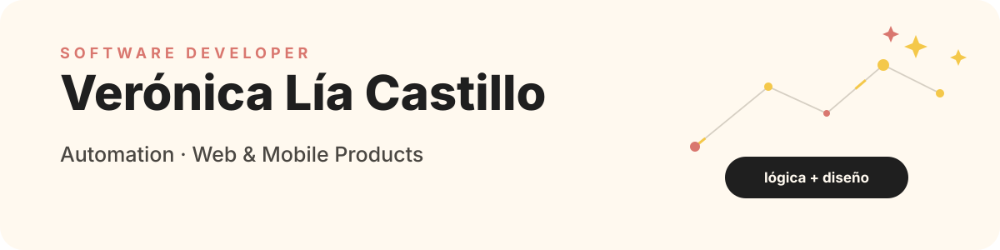
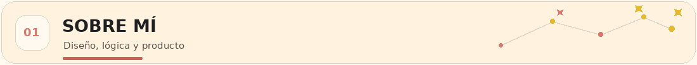
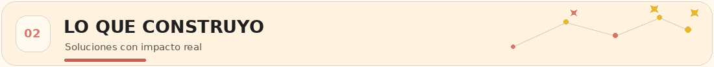
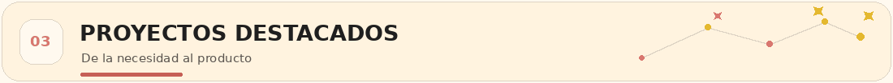
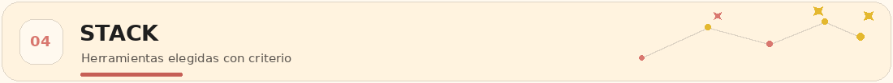
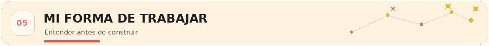
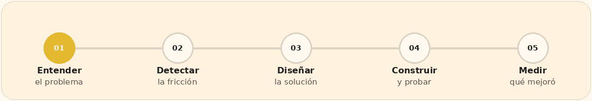
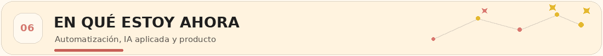
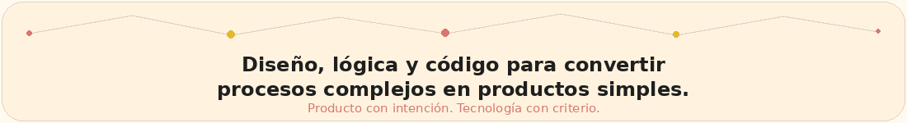

<picture>
  <source media="(prefers-color-scheme: dark)" srcset="./assets/profile-hero-dark.svg.svg">
  <source media="(prefers-color-scheme: light)" srcset="./assets/profile-hero-light.svg.svg">
  
</picture>

  
  
  

  

 

<picture>
  <source media="(prefers-color-scheme: dark)" srcset="./assets/section-about-dark.gif">
  <source media="(prefers-color-scheme: light)" srcset="./assets/section-about-light.gif">
  
</picture>

 

Soy desarrolladora de software y diseñadora, con una mirada integral sobre producto, experiencia de usuario y procesos.

Me interesa construir soluciones con impacto concreto: automatizar tareas repetitivas, ordenar información compleja, reducir errores y transformar necesidades reales en herramientas simples de usar.

<table>
  <tr>
    <td width="50%" valign="top">
      <h3 align="center">⚙️ Automatización</h3>
      
Testing, herramientas internas y procesos que dejan de depender del trabajo manual.

    </td>
    <td width="50%" valign="top">
      <h3 align="center">🧩 Desarrollo full stack</h3>
      
Productos web completos: interfaz, API, lógica de negocio y persistencia de datos.

    </td>
  </tr>
  <tr>
    <td width="50%" valign="top">
      <h3 align="center">📱 Producto mobile</h3>
      
Experiencias pensadas para contextos reales de uso, combinando lógica, usabilidad y diseño.

    </td>
    <td width="50%" valign="top">
      <h3 align="center">📊 Datos</h3>
      
Análisis y dashboards para transformar información compleja en decisiones claras.

    </td>
  </tr>
</table>

  <strong>Mi diferencial:</strong> unir pensamiento lógico, sensibilidad visual y comprensión del problema antes de escribir la primera línea de código.

 

<picture>
  <source media="(prefers-color-scheme: dark)" srcset="./assets/section-build-dark.gif">
  <source media="(prefers-color-scheme: light)" srcset="./assets/section-build-light.gif">
  
</picture>

 

<table>
  <tr>
    <td width="33%" valign="top" align="center">
      <h3>⚙️ Automatizaciones</h3>
      
Procesos que dejan de depender de tareas manuales, archivos dispersos o controles repetitivos.

      
<code>Python</code> <code>Excel</code> <code>APIs</code> <code>CI</code>

    </td>
    <td width="33%" valign="top" align="center">
      <h3>🌐 Productos web</h3>
      
Aplicaciones completas, desde la experiencia visual hasta la API, la lógica y los datos.

      
<code>Angular</code> <code>NestJS</code> <code>MongoDB</code>

    </td>
    <td width="33%" valign="top" align="center">
      <h3>📱 Experiencias mobile</h3>
      
Aplicaciones claras y usables, construidas con una mirada integral de producto.

      
<code>Android</code> <code>UX</code> <code>Product Design</code>

    </td>
  </tr>
</table>

 

<picture>
  <source media="(prefers-color-scheme: dark)" srcset="./assets/section-projects-dark.gif">
  <source media="(prefers-color-scheme: light)" srcset="./assets/section-projects-light.gif">
  
</picture>

 

<table>
  <tr>
    <td width="50%" valign="top">
      <h3 align="center">🌱 Root & Co.</h3>
      
<strong>Aplicación Android mobile desarrollada en equipo.</strong>

      
Un proyecto especialmente valioso por el desafío de aprender tecnología mobile mientras construíamos una experiencia completa y coherente entre tres personas.

      
<code>Android</code> <code>UX</code> <code>Trabajo colaborativo</code>

      
<a href="https://veronica-castillo.vercel.app/"><strong>Ver en mi portfolio →</strong></a>

    </td>
    <td width="50%" valign="top">
      <h3 align="center">🧪 Automation Testing Framework</h3>
      
<strong>Framework de pruebas UI y API para SauceDemo.</strong>

      
Page Object Model, Pytest, Selenium, Requests, datos externos, logging, reportes HTML, screenshots automáticos y ejecución con GitHub Actions.

      
<code>Python</code> <code>Pytest</code> <code>Selenium</code> <code>CI</code>

      
<a href="https://github.com/VGdC15/Proyecto-final-Automation-testing-veronica-castillo"><strong>Ver repositorio →</strong></a>

    </td>
  </tr>
  <tr>
    <td width="50%" valign="top">
      <h3 align="center">📋 Planificador Fono</h3>
      
<strong>Herramienta para automatizar la planificación académica.</strong>

      
Procesa datos desde Excel, evalúa correlatividades y genera reportes de materias disponibles y bloqueadas mediante una interfaz gráfica.

      
<code>Python</code> <code>Tkinter</code> <code>Pandas</code> <code>PyInstaller</code>

      
<a href="https://veronica-castillo.vercel.app/"><strong>Ver en mi portfolio →</strong></a>

    </td>
    <td width="50%" valign="top">
      <h3 align="center">🎵 Red Social de Fiestas Electrónicas</h3>
      
<strong>Aplicación full stack con interacción y administración.</strong>

      
Perfiles, publicaciones, imágenes, likes, comentarios editables, roles, moderación, dashboard administrativo y notificaciones en tiempo real.

      
<code>Angular</code> <code>NestJS</code> <code>MongoDB</code> <code>WebSockets</code>

      
<a href="https://github.com/VGdC15/TP-2--RedSocial"><strong>Ver repositorio →</strong></a>

    </td>
  </tr>
</table>

  
<strong>✦ Abrir más proyectos</strong>

   

  <table>
    <tr>
      <td width="33%" valign="top" align="center">
        <strong>🎮 Sala de Juegos</strong>  
        Angular, múltiples juegos, chat, puntajes y diseño responsive.  
        <a href="https://github.com/VGdC15/TP-1---Sala-de-juegos">Ver repositorio →</a>
      </td>
      <td width="33%" valign="top" align="center">
        <strong>📊 Mercado laboral argentino</strong>  
        Limpieza, exploración y modelado de microdatos de la EPH con Python.  
        <a href="https://github.com/VGdC15/Int-Analisis-de-datos---TP-FINAL">Ver repositorio →</a>
      </td>
      <td width="33%" valign="top" align="center">
        <strong>✨ Portfolio personal</strong>  
        Experiencia Angular para presentar proyectos desde una mirada visual y narrativa.  
        <a href="https://veronica-castillo.vercel.app/">Visitar portfolio →</a>
      </td>
    </tr>
  </table>

 

<picture>
  <source media="(prefers-color-scheme: dark)" srcset="./assets/section-stack-dark.gif">
  <source media="(prefers-color-scheme: light)" srcset="./assets/section-stack-light.gif">
  
</picture>

 

  
<strong>🧩 Desarrollo de producto</strong>

   
  

    
    
    
    
    
    
    
  

  
<strong>⚙️ Automatización, testing y datos</strong>

   
  

    
    
    
    
    
    
  

 

<picture>
  <source media="(prefers-color-scheme: dark)" srcset="./assets/section-process-dark.gif">
  <source media="(prefers-color-scheme: light)" srcset="./assets/section-process-light.gif">
  
</picture>

 

<picture>
  <source media="(prefers-color-scheme: dark)" srcset="./assets/workflow-dark.gif">
  <source media="(prefers-color-scheme: light)" srcset="./assets/workflow-light.gif">
  
</picture>

  No me interesa sumar tecnología por decoración. 
  Me interesa elegir la herramienta que haga que una solución sea <strong>más clara, mantenible y útil</strong>.

 

<picture>
  <source media="(prefers-color-scheme: dark)" srcset="./assets/section-now-dark.gif">
  <source media="(prefers-color-scheme: light)" srcset="./assets/section-now-light.gif">
  
</picture>

 

<table>
  <tr>
    <td width="33%" valign="top" align="center">
      <h3>⚙️ Automatización</h3>
      
Procesos, integraciones y herramientas de gestión.

    </td>
    <td width="33%" valign="top" align="center">
      <h3>🤖 IA aplicada</h3>
      
Usos concretos dentro de productos y flujos de trabajo.

    </td>
    <td width="33%" valign="top" align="center">
      <h3>✦ Producto</h3>
      
Soluciones que combinan desarrollo, datos y diseño.

    </td>
  </tr>
</table>

 

<picture>
  <source media="(prefers-color-scheme: dark)" srcset="./assets/closing-dark.gif">
  <source media="(prefers-color-scheme: light)" srcset="./assets/closing-light.gif">
  
</picture>

  <a href="https://veronica-castillo.vercel.app/"><strong>Portfolio</strong></a>
  &nbsp;·&nbsp;
  <a href="https://github.com/VGdC15"><strong>GitHub</strong></a>
  &nbsp;·&nbsp;
  <a href="https://www.linkedin.com/in/veronica-l-castillo"><strong>LinkedIn</strong></a>

